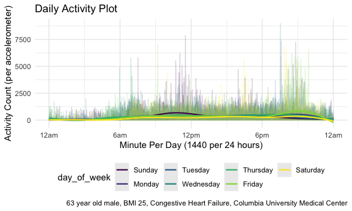

p8105\_hw3\_eh2928
================
Emil Hafeez (eh2928)
2020-10-10

\#Basic Setup

``` r
knitr::opts_chunk$set(echo = TRUE)

#Load relevant libraries, including for Problems 1 and 3
library(tidyverse)
```

    ## ── Attaching packages ──────────────────────────────────────────────────────────────────────────────────────────────────────────────────────────────────────────────────────────────────────────────────────────────────────────────────────── tidyverse 1.3.0 ──

    ## ✓ ggplot2 3.3.2     ✓ purrr   0.3.4
    ## ✓ tibble  3.0.3     ✓ dplyr   1.0.2
    ## ✓ tidyr   1.1.2     ✓ stringr 1.4.0
    ## ✓ readr   1.3.1     ✓ forcats 0.5.0

    ## ── Conflicts ─────────────────────────────────────────────────────────────────────────────────────────────────────────────────────────────────────────────────────────────────────────────────────────────────────────────────────────── tidyverse_conflicts() ──
    ## x dplyr::filter() masks stats::filter()
    ## x dplyr::lag()    masks stats::lag()

``` r
library(p8105.datasets)
library(patchwork)

#Prep for neater output
knitr::opts_chunk$set(
    fig.width = 6, 
  fig.asp = .6,
  out.width = "90%"
)

#Trying a darker theme, at least at first
theme_set(theme_minimal() + theme(legend.position = "bottom"))
options(
  ggplot2.continuous.colour = "viridis",
  ggplot2.continuous.fill = "viridis"
)

scale_colour_discrete = scale_colour_viridis_d
scale_fill_discrete = scale_fill_viridis_d
```

\#Problem 1

``` r
data("instacart")
```

This large dataset describes online grocery store purchases and contains
15 columns and a whopping 1384617 rows, where each row is a product from
a user’s order. The products are organized by characteristics like the
department, aisle, name, and numeric code, plus whether the product was
reordered by the user, in what order it was added to the user’s cart,
the day of the week, days since its last order, and more. The users are
demarcated by ID.

``` r
instacart %>% 
  count(aisle) %>% 
    arrange(desc(n))
```

Fresh vegetables, fresh fruits, and packaged vegetables & fruits are the
top three aisles from which products are most commonly ordered.

``` r
instacart %>% 
    count(aisle) %>% 
    filter(n > 10000) %>% 
    mutate(
        aisle = factor(aisle),
        aisle = fct_reorder(aisle, n)
    ) %>% 
    ggplot(aes(x = aisle, y = n)) + 
    geom_point() + 
    theme(axis.text.x = element_text(angle = -90, vjust = .5, hjust = 1))
```


It appears that fresh vegetables and fresh fruits in particular are
ordered with a much higher frequency than other aisles, and packaged
fruits and vegetables is a distant yet still popular third. There is a
sharp decrease to less popular aisles after the first two aisles, and
the frequency levels out steadily after the first ten or so most popular
aisles.

Table time\! Most popular items in each of 3 specific aisles, along with
the number of times they were ordered.

``` r
instacart %>% 
    filter(aisle %in% c("baking ingredients", "dog food care", "packaged vegetables fruits")) %>% 
    group_by(aisle) %>% 
    count(product_name) %>% 
    mutate(rank = min_rank(desc(n))) %>% 
    filter(rank < 4) %>% 
    arrange(aisle, rank) %>% 
    knitr::kable()
```

| aisle                      | product\_name                                 |    n | rank |
| :------------------------- | :-------------------------------------------- | ---: | ---: |
| baking ingredients         | Light Brown Sugar                             |  499 |    1 |
| baking ingredients         | Pure Baking Soda                              |  387 |    2 |
| baking ingredients         | Cane Sugar                                    |  336 |    3 |
| dog food care              | Snack Sticks Chicken & Rice Recipe Dog Treats |   30 |    1 |
| dog food care              | Organix Chicken & Brown Rice Recipe           |   28 |    2 |
| dog food care              | Small Dog Biscuits                            |   26 |    3 |
| packaged vegetables fruits | Organic Baby Spinach                          | 9784 |    1 |
| packaged vegetables fruits | Organic Raspberries                           | 5546 |    2 |
| packaged vegetables fruits | Organic Blueberries                           | 4966 |    3 |

Packaged fruits have the most orders among these (as noted, a very
popular category). Spinach, raspberries, and blueberries are the most
popular. Baking products (brown sugar, baking soda, cane sugar) sound
great. Dog food and care have low order numbers in comparison, and are
in order of treats, food, and biscuits.

``` r
instacart %>% 
    filter(product_name %in% c("Pink Lady Apples", "Coffee Ice Cream")) %>% 
    group_by(product_name, order_dow) %>% 
    summarize(mean_hour = mean(order_hour_of_day)) %>% 
    pivot_wider(
        names_from = order_dow,
        values_from = mean_hour
    )
```

    ## `summarise()` regrouping output by 'product_name' (override with `.groups` argument)

    ## # A tibble: 2 x 8
    ## # Groups:   product_name [2]
    ##   product_name       `0`   `1`   `2`   `3`   `4`   `5`   `6`
    ##   <chr>            <dbl> <dbl> <dbl> <dbl> <dbl> <dbl> <dbl>
    ## 1 Coffee Ice Cream  13.8  14.3  15.4  15.3  15.2  12.3  13.8
    ## 2 Pink Lady Apples  13.4  11.4  11.7  14.2  11.6  12.8  11.9

Here, we can see that the mean hour of product ordering tends to be
between the 11.0 and 15.5 hours of the day (11am and 3:30pm). The
overall latest ordering day of the week seems to be Wednesday, and the
earliest appears to be Friday.

# Problem Two

``` r
accel_df =
  read_csv(
      "./data/accel_data.csv") %>% 
  janitor::clean_names() %>% 
  pivot_longer(
    activity_1:activity_1440,
    names_to = "minute_per_day",
    values_to = "activity_count"
  ) %>% 
    mutate(minute_per_day = str_remove_all(minute_per_day, "activity_"),
    minute_per_day = as.numeric(minute_per_day)) %>% 
    rename(day_of_week = day) %>% 
    mutate(day_of_week = as.factor(day_of_week),
         day_of_week = forcats::fct_relevel(day_of_week, c("Sunday", "Monday", "Tuesday", "Wednesday", "Thursday", "Friday", "Saturday")))  %>% 
    arrange(week,day_of_week) %>% 
    mutate(
      weekend = case_when(
        day_of_week %in% c("Monday","Tuesday","Wednesday","Thursday","Friday") ~ "weekday",
        day_of_week %in% c("Saturday","Sunday") ~ "weekend"),
      weekend = as.factor(weekend)
      )
```

    ## Parsed with column specification:
    ## cols(
    ##   .default = col_double(),
    ##   day = col_character()
    ## )

    ## See spec(...) for full column specifications.

This dataset has 6 columns now that it’s been pivoted wide to long. It’s
tidied, using rows rather than columns to represent each minute of each
of the 35 days, for a total of (35\*1440) = `n nrow(accel_df)` rows.
Overall, it uses a week, then day of the week, then minute per day
structure to characterize activity counts over time.

Now, we aggregate across minutes to create a total activity variable for
each day, and create a table showing these totals.

``` r
accel_df %>% 
  group_by(weekend, week, day_of_week, day_id) %>% #Choosing to include weekend here, so as to investigate trends more clearly
  summarize(total_activity_daily = sum(activity_count)) %>% 
  arrange(
    desc(total_activity_daily)) %>% 
  knitr::kable(
              col.names =
                c("Weekend", "Week", "Day of Week", "Day Identifier", "Total Daily Activity"),
              align = "ccccc", 
              digits = 1)
```

    ## `summarise()` regrouping output by 'weekend', 'week', 'day_of_week' (override with `.groups` argument)

| Weekend | Week | Day of Week | Day Identifier | Total Daily Activity |
| :-----: | :--: | :---------: | :------------: | :------------------: |
| weekday |  3   |   Monday    |       16       |       685910.0       |
| weekend |  1   |   Sunday    |       4        |       631105.0       |
| weekday |  5   |   Friday    |       29       |       620860.0       |
| weekend |  2   |  Saturday   |       10       |       607175.0       |
| weekday |  2   |   Friday    |       8        |       568839.0       |
| weekday |  5   |  Thursday   |       33       |       549658.0       |
| weekday |  1   |   Friday    |       1        |       480542.6       |
| weekday |  2   |  Thursday   |       12       |       474048.0       |
| weekday |  3   |  Wednesday  |       21       |       468869.0       |
| weekday |  3   |   Friday    |       15       |       467420.0       |
| weekend |  3   |   Sunday    |       18       |       467052.0       |
| weekday |  5   |  Wednesday  |       35       |       445366.0       |
| weekday |  2   |  Wednesday  |       14       |       440962.0       |
| weekday |  4   |  Wednesday  |       28       |       434460.0       |
| weekday |  2   |   Tuesday   |       13       |       423245.0       |
| weekend |  2   |   Sunday    |       11       |       422018.0       |
| weekday |  4   |   Monday    |       23       |       409450.0       |
| weekday |  5   |   Monday    |       30       |       389080.0       |
| weekend |  3   |  Saturday   |       17       |       382928.0       |
| weekday |  3   |   Tuesday   |       20       |       381507.0       |
| weekend |  1   |  Saturday   |       3        |       376254.0       |
| weekday |  3   |  Thursday   |       19       |       371230.0       |
| weekday |  5   |   Tuesday   |       34       |       367824.0       |
| weekday |  1   |  Thursday   |       5        |       355923.6       |
| weekday |  4   |  Thursday   |       26       |       340291.0       |
| weekday |  1   |  Wednesday  |       7        |       340115.0       |
| weekday |  4   |   Tuesday   |       27       |       319568.0       |
| weekday |  1   |   Tuesday   |       6        |       307094.2       |
| weekday |  2   |   Monday    |       9        |       295431.0       |
| weekend |  4   |   Sunday    |       25       |       260617.0       |
| weekday |  4   |   Friday    |       22       |       154049.0       |
| weekend |  5   |   Sunday    |       32       |       138421.0       |
| weekday |  1   |   Monday    |       2        |       78828.1        |
| weekend |  4   |  Saturday   |       24       |        1440.0        |
| weekend |  5   |  Saturday   |       31       |        1440.0        |

There are no strongly identifiable trends in terms of which individual
days display highest total daily activity, though it does appear that
the weekend and weekdays adjacent to the weekend have more activity than
days in the middle of the week.

``` r
ggp_24_hour_activities =
accel_df %>% 
  ggplot(aes(x = minute_per_day, y = activity_count)) + 
  geom_line(aes(color = day_of_week), alpha = .15) + 
  geom_smooth(aes(color = day_of_week), alpha = 0.2, size = .75) +
   scale_x_continuous(
    breaks = c(0, 360, 720, 1080, 1440), 
    labels = c("12am", "6am", "12pm", "6pm", "12am")) +
  labs(
    title = "Daily Activity Plot",
    x = "Minute Per Day (1440 per 24 hours)",
    y = "Activity Count (per accelerometer)",
    caption = "63 year old male, BMI 25, Congestive Heart Failure, Columbia University Medical Center") 
ggp_24_hour_activities
```

    ## `geom_smooth()` using method = 'gam' and formula 'y ~ s(x, bs = "cs")'


This single-panel plot showing the 24 hour time courses for the
individual’s activity for each day (parsed by day of the week) helps
illustrates that the individual tends to be less active between the
hours of 12am and about 9am every day of the week (presumably asleep),
as well as between about 3pm and 6pm. Overall, the individual appears to
show more activity during the late morning, and in the evening between
about 7:30pm and 10:30pm. Regarding days of the week, it appears that
Sundays tend to be more active than other days in the late morning, and
that Fridays are the most active of all days in the late evening. (Quick
note: I’m (very) deuteronopic, and even with the veridis package and
trying different themes, sizes, and so on, still a little hard to tell.
I’ll reach out for advice.)

# Problem 3

``` r
data("ny_noaa")
```

``` r
ny_noaa =
ny_noaa %>% 
  janitor::clean_names() %>% 
  separate(date, into = c("year", "month", "day_of_month")) %>% 
  mutate(
        tmax = as.numeric(tmax),
        tmin = as.numeric(tmin),
        year = as.numeric(year),
        month = as.numeric(month),
        day_of_month = as.numeric(day_of_month)
        ) %>% 
  mutate(
        prcp = (prcp / 10),
        tmax = (tmax / 10),
        tmin = (tmin / 10),
        )
ny_noaa %>% 
  count(snow) %>% 
    arrange(desc(n))
```

    ## # A tibble: 282 x 2
    ##     snow       n
    ##    <int>   <int>
    ##  1     0 2008508
    ##  2    NA  381221
    ##  3    25   31022
    ##  4    13   23095
    ##  5    51   18274
    ##  6    76   10173
    ##  7     8    9962
    ##  8     5    9748
    ##  9    38    9197
    ## 10     3    8790
    ## # … with 272 more rows

The NY NOAA dataset is a large rectangle of 2595176 weather observations
in NY state, structured by 747 weather stations at which the data were
collected, in conjunction with the date of that observation. Then, there
is the total precipitation (in tenths of millimeters), specifically snow
characteristics, and the temperature minimum and maximum (in celsius).

The most commonly observed snowfall value by far is 0 (since most days
in these locations, it doesn’t snow\!). Then, unfortunately, there are a
lot of missing values for snowfall (potentially measurement error,
potentially a null value), and then various millimeter values.

### Problem 3 Part 2

Make a two-panel plot showing the average max temperature in January and
in July in each station across years. Is there any observable /
interpretable structure? Any outliers?

``` r
ggp_max_temps =
ny_noaa %>% 
  filter(month %in% c(1 , 7)) %>% 
  group_by(id, year, month) %>%
  summarize(mean_tmax = mean(tmax, na.rm = TRUE)) %>%
  ggplot(aes(x = year, y = mean_tmax, group = id)) + 
  geom_point(aes(color = mean_tmax), alpha = .5) + 
  facet_grid(. ~ month) +
  labs(
    title = "Mean Maximum Temperatures in NY State, January and July",
    x = "Year",
    y = "Mean Max Temperature (in °C)",
    caption = "From NY_NOAA Dataset")
```

    ## `summarise()` regrouping output by 'id', 'year' (override with `.groups` argument)

The graph shows a distinctly higher average max temperature in July
versus January, and a few outliers in both months. There appear to be
more max temperature irregularities in January than in July;
additionally, January shows a few uncharacteristically warm days and
July shows a few uncharacteristically colder days. Overall, of concern
and not unrelated to narratives regarding global warming trends.

Finally, we make a two-panel plot showing tmax vs tmin for the full
dataset, and then make a plot showing the distribution of snowfall
values greater than 0 and less than 100.

``` r
ggp_max_min_hex = 
ny_noaa %>% 
  select(id, year, month, tmax, tmin) %>%
  pivot_longer(
      tmax:tmin,
      names_to = "observation",
      values_to = "temperature"
              ) %>% 
  ggplot(aes(x = year, y = temperature)) + 
  geom_hex(aes(color = temperature), alpha = .5) + 
  facet_grid(. ~ observation) +
  labs(
    title = "Distributions of Maximum and Minimum Temperatures in NY State, 1981-2010",
    x = "Year",
    y = "Mean Max Temperature (in °C)",
    caption = "From NY_NOAA Dataset") +
  theme(plot.title = element_text(hjust = .5))
```

``` r
ggp_snow = 
ny_noaa %>% 
  select(id, year, month, tmax, tmin, snow) %>%
  filter(snow > 0, snow < 100) %>% 
  ggplot(aes(x = year, y = snow, color = year, group = year)) + 
  geom_boxplot(alpha = .4) + 
  labs(
    title = "Distributions of Snowfall in NY State, 1981-2010",
    x = "Year",
    y = "Snowfall in millimeters",
    caption = "From NY_NOAA Dataset") +
  theme(plot.title = element_text(hjust = .5))

ggp_max_min_hex / ggp_snow
```

    ## Warning: Removed 2268778 rows containing non-finite values (stat_binhex).


